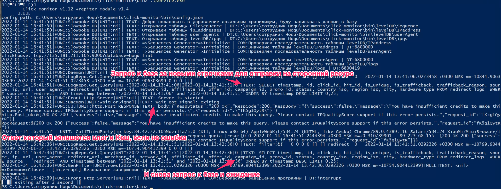
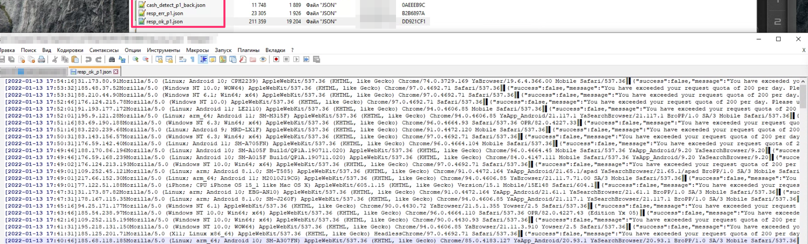
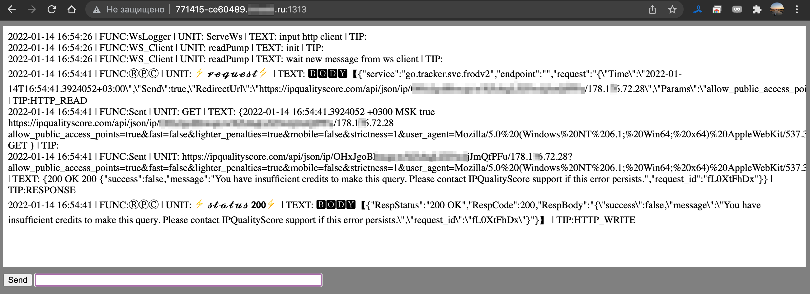

## Click Monitor and Repiter Tools 
#### Отправка запросов с удаленного анонимного сервера.
Подключать публичные хосты можно как с "белым", так и "серым" ip.  


1) Для получения данных используем выборку из БД Clichouse о новых кликах
    - в исходниках простой SQL select, с генерацией небольшого диапазона времени 
    - мониторинг таблицы на появление новых кликов с рекламных площадок
2) Подготавливает URL для отправки в сторонний сервис где мы не хотим себя показывать
    - подготавливает, но сам отправляет только на репитеры, так как его "IP" нам нужно анонимизировать
4) Сортирует полученный результат на ошибки, ок и найденные в кеше для "мини Репортинга". 
    - отчет в реальном времени в папке report  
          * сколько повторных переходов  
          * сколько каждый хост клинт обратал данных  
          * данные об ошибках и ворнингах  
    - сохранение в OLTP базу для дальнейшей работы с данными
5) Кеширует запросы по IP и сохраняем UserAgent и дату

Скриншот ***click-monitor.exe***
  
  
Скриншот удаленного ws терминала ***rest-repiter.exe***  
  

Конфигурации лежат в папке bin 

Компиляция:  
```sh
CGO_ENABLED=0 GOOS=windows go build -gcflags "all=-N -l" -o service.exe
CGO_ENABLED=0 GOOS=linux go build -gcflags "all=-N -l" -o service
```

Далее необходимо сделать его исполняемым:
```sh
chmod +x ./rest-repiter_v1.4
```
Запуск:  
```sh
./rest-repiter_v1.4 1>log1stdout.txt 2>log1stderr.txt
```
или если хотите оставить демона в системе
```sh
nohup ./rest-repiter_v1.4 &
```

Замечания к выпуску:  
- Пример запроса для rest-repiter
```json
{"service":"go.tracker.svc.repiter","endpoint":"","request":"{\"Time\":\"2022-01-15T00:24:13.1951894+03:00\",\"Send\":true,\"RedirectUrl\":\"http://sky.net.kg/reciver/ip/91.193.178.11\",\"Params\":\"allow_public_access_points=true\\u0026fast=false\\u0026lighter_penalties=true\\u0026mobile=false\\u0026strictness=1\\u0026user_agent=Mozilla/5.0%20(Linux;%20arm_64;%20Android%2011;%20SM-A805F)%20AppleWebKit/537.36%20(KHTML,%20like%20Gecko)%20Chrome/94.0.4606.85%20YaApp_Android/21.117.1%20YaSearchBrowser/21.117.1%20BroPP/1.0%20SA/3%20Mobile%20Safari/537.36\",\"Method\":\"GET\",\"Body\":\"\",\"Type\":\"\"}"}
```
